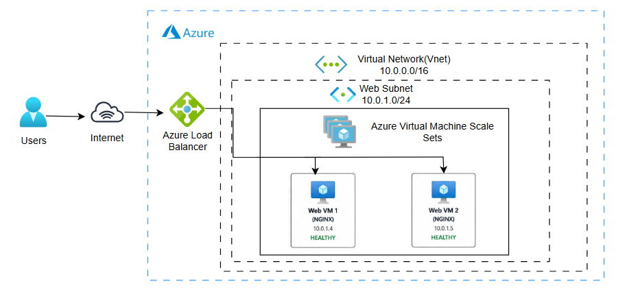

# Auto_healing_web_tier

Infrastructure provisioning for an auto-healing web tier on Azure using Terraform.

## Architecture

The following architecture implements a self-healing web tier on Microsoft Azure. Terraform provisions the infrastructure, while an Azure Load Balancer distributes traffic across multiple NGINX virtual machines to provide high availability and continued service if a VM becomes unavailable.



## Overview

This project provisions an auto-healing web tier consisting of:

- Azure Resource Group
- Virtual Network and subnet
- Network Security Group for HTTP access
- Azure Load Balancer with public IP
- VM Scale Set with automatic instance repair
- NGINX installed via cloud-init

## Prerequisites

Before running Terraform, ensure the following are available:

- Terraform v1.10.0 or later
- Azure CLI installed and authenticated
- An Azure subscription
- Permission to create resource groups, networking, load balancers, and virtual machine scale sets

## Azure authentication

Authenticate to Azure before deploying:

```bash
az login
```

## SSH key configuration

The VMSS uses a public SSH key for Linux authentication. This key is intentionally not hardcoded in the repository so the project can be used on any machine without exposing personal credentials.

Create a local file named `terraform.tfvars` from the example file:

```bash
cp terraform.tfvars.example terraform.tfvars
```

Then update `terraform.tfvars` with your own SSH public key:

```hcl
admin_ssh_public_key = "ssh-rsa AAAAB3NzaC1yc2EAAAADAQABAAABAQC...your-public-key..."
```

You can also pass the key via environment variable instead of a local file:

```bash
export TF_VAR_admin_ssh_public_key="ssh-rsa AAAAB3NzaC1yc2EAAAADAQABAAABAQC...your-public-key..."
```

On Windows PowerShell:

```powershell
$env:TF_VAR_admin_ssh_public_key = "ssh-rsa AAAAB3NzaC1yc2EAAAADAQABAAABAQC...your-public-key..."
```

> `terraform.tfvars` is intentionally excluded from Git via `.gitignore` so local environment-specific values are never pushed to source control.

## Steps to run the Terraform workflow 

Commands to Initialize and validate the configuration:
```bash
terraform init
terraform validate
```

Review the deployment plan:

```bash
terraform plan
```

Apply the infrastructure:

```bash
terraform apply
```

Destroy the infrastructure when no longer needed:

```bash
terraform destroy
```

## Azure monthly estimate

## Notes

- The example file [terraform.tfvars.example](terraform.tfvars.example) is safe to commit because it contains a placeholder only.
- The real `terraform.tfvars` file should remain local and untracked.
- The VMSS is configured with automatic instance repair and a health probe on port 80.
